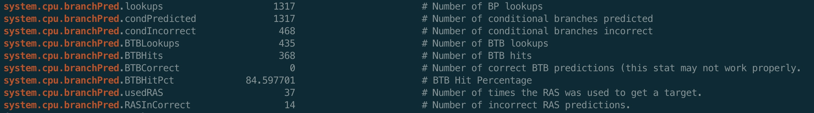

# gem5 Setup Steps

## About gem5
Gem5 is a discrete event simulator  
Events are fetched from event queue and is executed, while the other events are being queued back

gem5 is controlled by python scripts and C++ objects can be used directly in Python

---

> ### Server Access: ssh <net_id>@<_server>


--- 

## Build project

~~scons gem5/build/X86/gem5.opt -j5~~   
Do not use this approach - will give Error. Use the build from the gem5 root folder directly  
> Value of j = (# of cpu's + 1)  

``` scons build/X86/gem5.opt -j5 ```

- scons = is the build system
- gem5.out = binary we will be building 
- 5 represents the parallel resources (use atleast 5)  
Command: ``` lscpu ``` - to get the list of vcpu & other configs of the machine 

Alternatives for opt
> opt - optimized  
> perf - to calculate the performance numbers  
> fast - bunch of simulations   
> debug - no optimizations  


### Time taken 

Approx. build time
```
scons: done building targets.

real	9m7.884s
user	25m15.291s
sys	2m48.229s
```

### Help from gem5 binary   
``` build/X86/gem5.opt --help ```

--- 
## Running the simulation 
Using [simple.py](./python-simulation/simple.py) (simple system written in python)   

``` build/X86/gem5.opt /home/012/v/vx/vxt200003/gem5/gem5/configs/example/simple.py ``` 

Output

Use the Hello world simulator ``` tests/test-progs/hello/bin/x86/linux/hello``` will print Hello World!


## Updating the System with BranchPredictor

Added LocalBP() instead of **NULL** to Existing [BaseSimpleCPU()](./python-simulation/BaseSimpleCPU.py)


---
## Benchmark
``` git clone https://github.com/timberjack/Project1_SPEC.git ```


Move the runGem5.sh script into one of the simulators folder

``` cp -v -f runGem5.sh 458.sjeng/ ```

### run the run gem5 script
``` bash runGem5.sh```   

The script contains the below code:  

``` time $GEM5_DIR/build/X86/gem5.opt -d ./m5out $GEM5_DIR/configs/example/se.py -c $BENCHMARK -o "$ARGUMENT" -I 500000000 -- cpu-type=timing --caches --l2cache --l1d_size=128kB --l1i_size=128kB -- l2_size=1MB --l1d_assoc=2 --l1i_assoc=2 --l2_assoc=4 --cacheline_size=64```

### The above configs remain constant throughout the program

### Main Configuration Parameters: 
- I = # of instructions
- BENCHMARK - the benchmark binary to be used for evaluation - it will be located inside src of the benchmark (ex: Project1_SPEC/458.sjeng/src/benchmark)
- cpu-type = Can be timing / atomic type
- cache configurations

~~customize the run parameters in accordance to the requirement like cache, # of instructions etc.~~

a folder m5out will be generated containing, 
- stats.txt will contain all the stats of the run
- config.ini - configurations that are being used for the run 
- config.json - same configurations in JSON format

## Analysis of the compilation stats
``` cat config.ini | grep -i system.cpu.branchPred``` - will give all the stats during the test 


And, can use the below Formulaes to compute the BTB & Mis Predictions & Percentages
``` 
BTBMissPct = (1 - (BTBHits/BTBLookups)) * 100
where: BTB Hits -> total number of BTB Hits BTBLookups -> total number of BTB References
 ```
``` 
BranchMispredPercent = (numBranchMispred / numBranches) * 100;

where: numBranchMispred -> total number of mispredicted Branches numBranches -> total number of branches fetched
```


### Adding Custom Parameters 

<-Line 227 @  >
void BaseSimpleCPU::regStats() {


}

## Updating branch predictor configurations

Modify the changes for specific Predictor at ``` src/cpu/pred/BranchPredictor.py```
A sample file is attached [here](./python-simulation/BranchPredictor.py)

### Possible Configurations:
BTB Values: 4096, 2048  

- Local Predictor: 2048, 1024
    => 2x2 = 4 possible combinations
    |BTB | Local Predictor | status |
    |----|:---------------:|:------:|
    |2048| 2048, 1024      | `done`   |
    |4096| 2048, 1024      | `done`   |

- BiMod Predictor:  
    Global: 8192, 4096, 2048  
    Choice: 8192, 4096, 2048 
    => 3x3x2 = 18 combinations
- Tournament Predictor:  
    Local: 2048, 1024   
    Global: 8192, 4096  
    Choice: 8192, 4096 
    => 2x2x2x2 = 16 combinationsc
    BTB 4096 
    Completed: L = 2048, G = 8192, C = 8192
 